  

# Darsh Garg

**I build AI/ML systems that turn hard problems into measurable business impact.**

I work end to end—from framing the decision and selecting the right approach to building the data, evaluation, infrastructure, and reliability around it. The goal is not a clever demo; it is an outcome that holds up against real baselines.

**Focus:** Retrieval · Recommendation · Agent Infrastructure · Decision Systems · Multi-Agent Systems & MARL

[Website](https://darshgarg.com/) · [Résumé](https://docs.google.com/document/d/1wPq1AzhBjIJ2RCblwtiiFtAmqV8msn6fN4dbv9Wz8no/edit?usp=sharing) · [LinkedIn](https://www.linkedin.com/in/darshgarg13579/) · [darsh.garg@gmail.com](mailto:darsh.garg@gmail.com)

## Selected Work

- **[Bouncer](https://github.com/darshgarg7/Bouncer)** — deterministic authorization for AI agents. 100k-case Go/Python policy parity, fuzz/race-tested, tamper-evident execution logs.
- **[Tortus](https://github.com/darshgarg7/Tortus)** — graph retrieval for multi-hop reasoning. 0.83 path recall at 165ms p95, 40% lower graph fanout than the nearest baseline.
- **[Recommender Lakehouse](https://github.com/darshgarg7/Recommender-Lakehouse)** — cold-start recommender on a 2.22M-line Databricks system. Correctly rejected advanced candidates when confidence gates didn't clear.
- **[Agentic Procurement](https://github.com/darshgarg7/AgenticProcurement)** — Bayesian purchasing under uncertainty. 58% lower realized regret than a buy-now baseline, with explicit abstention.
- More: [CausalOps](https://github.com/darshgarg7/CausalOps) · [MCP Reputation Policy](https://github.com/darshgarg7/MCP-Reputation-Policy) · [PLUS MANY MORE](https://github.com/darshgarg7?tab=repositories)

## Industry Impact

- Reduced simulated HVAC energy use 15% (~$2M/year projected) while holding 95% setpoint accuracy — [Honeywell](https://darshgarg.com/cv#impact-heading)
- Improved grounded-answer accuracy from 76% to 92% and made internal technical-question response 65% faster — [college.xyz](https://darshgarg.com/cv#impact-heading)
- Reduced anomaly-detection false positives 30% and improved threat-identification accuracy 20% — [177th CPT, U.S. Army Minnesota National Guard](https://darshgarg.com/cv#experience-heading)
- Achieved stable coordination on the SMAC `2s3z` map while attention-gated communication reduced message volume — [Feudal MARL case study](https://darshgarg.com/projects/feudal-marl)

## Vision

Build AI systems that solve increasingly complex real-world problems—from enterprise decision-making to autonomous agents—while treating evaluation, reliability, and measurable impact as first-class engineering concerns.

## Leadership & Recognition

**Leadership**

- Founder & President, AI Innovators Society (80+ members, $5,000 raised)
- Director of Technology, 0→1 Startup Club (mentored 15 student startups)

**Recognition**

- 1st — Northland Hackathon
- 1st — MinneHack
- 1st — UMN Biz Pitch
- 2nd — O1 AI Summit, Holmes Center, MIT NandaTown

## What I'm looking for

I'm looking for teams where I can own the AI/ML system end to end—from model architecture and retrieval through evaluation, infrastructure, and production reliability. I'm particularly drawn to problems where the modeling decisions matter and success can be measured against real baselines.

## Contributions

  

---

  Open to collaborating on agentic AI, AI systems, and applied GenAI research. If you're building something interesting, reach out via <a href="https://www.linkedin.com/in/darshgarg13579/">LinkedIn</a> or <a href="mailto:darsh.garg@gmail.com">email</a>.

